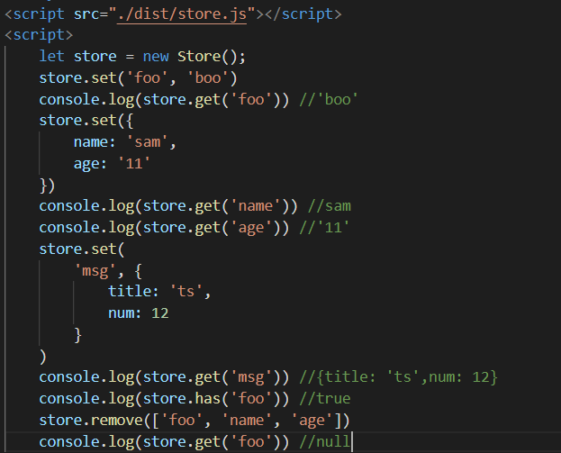

# 云顶书院六期全栈方向TS第一次学习任务

## 学习任务
#### 1. 安装TS并配置TS运行环境

安装ts：在vscode终端里输入npm install typescript

具体可以参考菜鸟教程中的安装部分

node环境中，由于我们每次运行代码都要重新执行编译，为了让代码能够热更新，我们可以使用nodemon让我们每次保存代码，代码就能自动更新

参考文章：https://juejin.cn/post/6914106252683378701

对于ts还需要配置nodemon的一些参数：

https://juejin.cn/post/6844903999947145223

#### 2.学习TS的基本语法

菜鸟教程：https://www.runoob.com/typescript/ts-tutorial.html

菜鸟教程上的东西比较偏基础，我个人学习TS是先看完菜鸟教程，然后看这篇文章进行查缺补漏的：

https://juejin.cn/post/7031787942691471396

把重点放在基础内容上，装饰器的部分可以先跳过，泛型，抽象短时间无法理解的话先留个印象即可，TS的类型机制一定要会！

------

## 本次作业

### 用TS对localstorage进行二次封装

传统的localstorage有一些弊端，比如键值都只能是字符串，而且一次只能存储一个键值。对于这种API，我们一般要进行二次封装，写成一个第三方库，在它的基础上提供一些附加功能（axios就是对xhr进行二次封装的第三方库）

实现一个**Store类**，要求实现以下方法：

get（key）：获取localstorage中key对应的值，如果储存时值是一个对象，那么使用get获取时会获取到对象而不是字符串

set（key，val）：设置localstorage中名为key的键的值为val，如果传入的是一个对象，那么会将该对象的每一个键值设为localstorage的键值

has（key）：返回一个布尔值，判断localstorage是否存在键名为key的键对值

remove(key|key[]):传入一个key或一个数组，key或数组中的每一项在localstorage中对应的键对值都会被清除

clear():清空localstorage中所有的键对值

调用示例：
    

**作业中不要使用类型any!!!**

### 作业验收

1.2022年3月12日晚上10点前将作业提交至开源仓库中自己的文件夹中

2.文件夹命名格式：全栈-闫韬蒙-TS第一次任务

3.提交内容： 将文件夹提交至开源仓库，文件夹命名格式：全栈-闫韬蒙-TS第一次任务，文件夹内须包含：TS文件，编译后的JS文件，测试使用的html文件

* 4.不得无故不交作业，不得抄袭